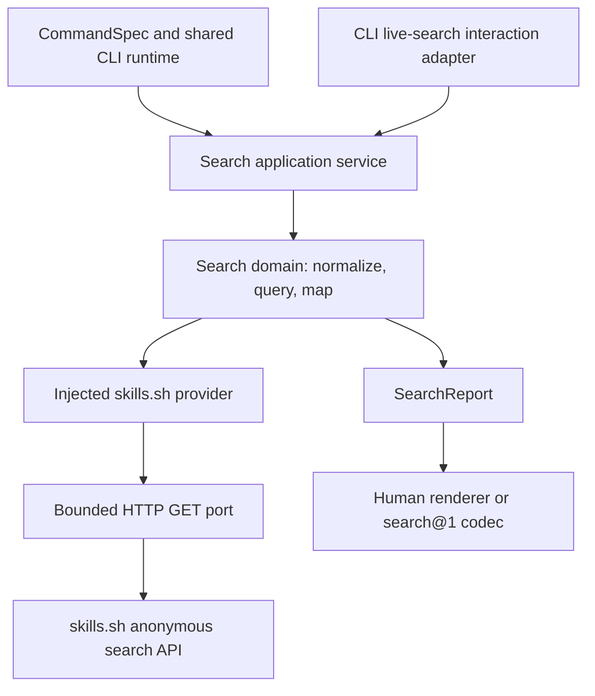

# Skillsmith search implementation plan

**Status:** Search is implemented in PR #100 on `feat/search-discovery`, based on Skillsmith `ddcb870`. Its final Linux CI passed at `8189acb`. The user has refined the second-PR interface to `--skill <name>` with directory-first matching and the boolean `--skills-match-frontmatter` override. The user approved implementation. The authoritative second-PR plan is [the repository skill selection plan](2026-09-20-skillsmith-install-selector-implementation.md), now ready after three adversarial reviews and follow-up checks; runtime implementation has not started.

**Outcome:** Add `skillsmith search` to the existing DISCOVER command group, using the same hosted search endpoint as Vercel's `skills` CLI. The first PR displays catalog details and URLs. It does not add an install selector, print install commands, or publish an `installHint` field.

**User requirements:** The default search deadline is **2 minutes**, overrideable with `--timeout`. The maximum decoded response body is **10 MB**, overrideable with `--max-response-size`.

**Evidence baseline:** Skillsmith `b65c94c88e5f8d6098a7182e7f7c1060918469f1`; Vercel `skills` `7407f3893ad4dceab546ac002c3ef806e4000c73`. Both local checkouts were updated to `origin/main` during research. Refresh relevant source before implementation if either baseline moves.

**Delivery boundary:** The first PR remains search-only. Section 3 and SEARCH-05 link the separately reviewed second-PR plan. The install-signature approval gate and implementation-plan review are complete. This plan does not authorize a release, a merge, or changes to existing publication holds. Task identifiers `SEARCH-01` through `SEARCH-09` are local to this plan; they are not reserved project IDs. P17 explicitly deferred remote search, so this plan does not reopen P17 or change its historical completion evidence.

## 1. Product contract

### Commands and flags

The canonical command is `search`; `find` is an alias. The command searches remote skill listings. The existing DISCOVER group also contains commands that inspect local abilities. These remain distinct operations: catalog entries are not installed `SkillEntry` records, plugins, or slash commands.

The proposed interface is:

```text
skillsmith search [query...] [--owner <owner>] [--limit <number>]
                 [--timeout <duration>] [--max-response-size <size>]
                 [--interactive] [--json]
skillsmith find [query...] [same options]

```

| Option | Default | Contract |
| --- | --- | --- |
| `[query...]` | Absent | Join words with spaces, then trim. An explicit query must contain at least two Unicode code points. An explicitly supplied empty or whitespace-only query is invalid. |
| `--owner <owner>` | None | Filter by one GitHub owner. Use the upstream owner grammar, case-insensitive: `^[a-z0-9](?:[a-z0-9-]{0,38})$`. This filters indexed entries; it is not an inventory of every repository owned by that account. |
| `--limit <number>` | `20` | Positive decimal integer from `1` through `20`, inclusive. This is Skillsmith's initial policy, not a claim about the provider's maximum. |
| `--timeout <duration>` | `2m` | One deadline of `120_000` milliseconds per issued query, including connection setup, response reading, retry delay, and all attempts. |
| `--max-response-size <size>` | `10MB` | At most `10_000_000` bytes in one response body after decompression, before UTF-8 decoding and JSON parsing. Applies to each attempted response. |
| `--interactive` | Automatic only for bare search | Open the live query/results picker, optionally seeded by the supplied query. Selection displays the chosen entry's details and catalog URL. |
| `--json` | Off | Emit one strict `search@1` report on stdout, or the shared `error@1` report on failure. |

All value options above are singular. Reject repeated occurrences, including mixed `--flag value` and `--flag=value` forms. Reject unknown flags. Preserve the `--` option terminator for query text beginning with a dash.

Duration overrides accept a positive decimal integer followed by `ms`, `s`, `m`, or `h`. Units are case-sensitive. Examples: `500ms`, `90s`, `2m`, `1h`. The converted value must be from `1` through `2_147_483_647` milliseconds, the supported single-timer range. Reject omitted units, fractions, signs, whitespace inside the value, zero, overflow, infinity, and trailing text. The timeout cannot be disabled with `0`.

Size overrides accept a positive decimal integer followed by `B`, `KB`, `MB`, `KiB`, or `MiB`. Units are case-sensitive. `KB` and `MB` use decimal factors; `KiB` and `MiB` use binary factors. Examples: `500KB`, `20MB`, `16MiB`. The converted value must be from `1` through `2_147_483_647` bytes. Reject omitted units, fractions, signs, zero, overflow, and trailing text. This range permits both smaller and larger limits; it does not promise that the runtime can allocate every permitted size.

These grammars and upper bounds are implementation decisions in this plan. The user explicitly requested the defaults and CLI overrides. Keep parsing pure and validate the normalized numeric values again at the core boundary for non-CLI callers.

### Invocation behavior

| Invocation | Result |
| --- | --- |
| `skillsmith search react` | Query once, print results, exit. The bounded retry policy may make one additional HTTP attempt. |
| `skillsmith search react native --owner expo --json` | Search the joined query `react native`; emit JSON without prompts. |
| `skillsmith search react --timeout 4m --max-response-size 20MB` | Use a four-minute total deadline and a 20,000,000-byte decoded-body limit. |
| `skillsmith search` with stdin, stdout, and stderr attached to terminals | Open the picker with an empty query. Send nothing until the query reaches two code points. |
| `skillsmith search --interactive react` | Open the picker with `react` as its initial query. |
| Bare search with `--json`, `--no-prompt`, `--quiet`, or any required stream redirected | Usage error before network access; request an explicit query. |
| `--interactive` with `--json`, `--no-prompt`, `--quiet`, or a non-terminal required stream | Usage error before network access. |
| Explicit query with redirected output or `--no-prompt` | Perform noninteractive search normally. |

The three-stream check is search-specific. Existing shared interaction policy checks stdin and stderr; do not change other commands' prompting behavior merely to add stdout gating for search. For explicit noninteractive queries, existing `--quiet` behavior suppresses human success output and preserves JSON and errors.

The picker accepts Unicode input, supports scrolling through every returned result, and debounces query changes by 250 milliseconds. A new query cancels the previous request immediately. Use a generation number as well as cancellation so an older response cannot replace newer results. Each issued query gets its own timeout; time spent typing does not consume a network deadline.

Selection displays the selected result's catalog details and URL. It does not print an install command, install, verify, clone, or invoke a subprocess. Escape/Ctrl-C cancels the picker. Restore terminal mode and dispose timers, readers, and listeners on every exit path. A provider error is shown distinctly from an empty successful search; the user can edit the query and try again.

### Result and exit semantics

- Preserve provider result order. Do not describe this as a guaranteed relevance ranking. Display installation counts separately; they do not establish trust or verification.
- Return `0` for successful search, including zero results; `2` for invalid usage; `5` for provider/source failures; `130` for interruption; `1` for unexpected runtime failure. Retain the current SIGTERM mapping to `130` as existing compatibility behavior.
- Distinguish deadline expiration, cancellation, rate limiting, unavailable service, invalid response, and response-size refusal. Use the diagnostic codes `search-timeout`, `search-rate-limited`, `search-unavailable`, `search-invalid-response`, and `search-response-too-large`; use the existing `cancelled` and invalid-argument handling for cancellation and usage. These diagnostics pass through the existing error renderer and envelope. Do not turn failures into empty result lists.
- Report `returned` and the requested `limit`. Do not invent a total result count, a next-page token, or `hasMore` from this endpoint.
- Search does not write a cache, manifest, lockfile, inventory, or installation state. It does not add telemetry. The query and optional owner are necessarily sent to skills.sh; document that fact.
- Treat the provider as **experimental**. The anonymous legacy endpoint works and is used by the Vercel CLI, but it has no verified public stability or rate-limit contract.

## 2. Architecture and data contracts

### Request flow



`CommandSpec` is the existing registry record that owns command grammar, help, and completion metadata. A *port* is an injected interface for an effect such as HTTP or terminal input. Core search code receives only the ports it needs. The CLI owns terminal behavior and final rendering.

Use one provider interface with one skills.sh implementation. Do not introduce a provider plugin framework, a local search index, or a configurable public endpoint in this change. Keep `registry.default` and `SKILLSMITH_REGISTRY` semantics unchanged; neither currently defines a search service.

Create a focused `SearchApplicationContext` with observation, search provider, interaction capability, and cancellation. Add a search-specific composition path in `runtime/context.ts` and select it from `program.ts`. It must not resolve an installation project, scan tools, instantiate a mutation workflow, or load an inventory. Retain existing root-global preflight behavior. If the application-service type requires adjustment to accept a focused context, make that adjustment explicit and type-checked; do not fabricate unused write ports or cast an incomplete aggregate context.

Keep the existing `HttpPort.request(HEAD)` contract unchanged. Add a separate `HttpReadPort` for bounded GET responses. Keep actual `fetch` ownership in `packages/core/src/ports/http.ts`, with focused factories composed/exported through the existing default adapter. Do not add a required method to every existing `RuntimePorts` or `HttpPort` fake.

`HttpReadPort` accepts a URL, an abort signal, and a decoded-byte ceiling. It returns status, the response headers needed for validation and retry, and bounded decoded bytes. Search supplies one deadline signal shared by all attempts. The adapter must keep cancellation connected until body consumption and cleanup finish.

Add a small injected scheduling capability for deadline timers and abortable retry waits. Use the existing monotonic clock for elapsed time and epoch clock only to interpret an HTTP-date `Retry-After`. Implement real scheduling in the capability adapter and fake it in tests. Do not import the GC planning module to reuse its duration parser.

### Search records

The owned report below is separate from skills.sh's response shape. A catalog identifier identifies a provider listing, not a repository path. A provider name is catalog metadata and is not verified against current `SKILL.md` frontmatter.

```ts
interface SearchHit {
  kind: "skill";
  catalogId: string;
  providerSkillId: string | null;
  name: string;
  source: string | null;
  installs: number | null;
  url: string;
  verification: "not-checked";
}

interface SearchReport {
  provider: "skills.sh";
  query: string;
  owner: string | null;
  limit: number;
  returned: number;
  searchType: "fuzzy" | "semantic" | "unknown";
  results: SearchHit[];
}

interface SearchV1Dto extends SearchReport {
  schemaVersion: 1;
  kind: "skillsmith.search";
}
```

Use an internal application report `{ value: SearchReport | null, selectedCatalogId: string | null }`, following the existing guarded renderer pattern. Failure carries `value: null` and an error diagnostic; selection is populated only on successful interactive selection. The `search@1` mapper consumes `value` and contains exactly the fields above. A failure uses the shared error renderer once, without a success report or duplicate diagnostic output.

At the provider boundary:

1. Request `GET https://skills.sh/api/search` with URL-encoded `q`, `limit`, and optional `owner`. Do not switch to `/api/v1/skills/search`, which requires authentication.
2. Validate required envelope and hit fields. Accept unknown provider fields, then discard them when constructing owned records. Validate consumed optional fields when present. Map an absent or unrecognized search type to `unknown`. Take the report's `query`, `owner`, and `limit` from the normalized request, not unchecked response echoes.
3. Preserve identifiers and names exactly. Never sanitize an identifier into a different operational selector. Reject unusable required identifiers. Escape untrusted text in terminal renderers.
4. Preserve a present string source as data. A missing or unsupported source remains a visible result. Do not infer installation selectors or emit an install command from catalog metadata.
5. Construct catalog URLs on a fixed skills.sh HTTPS origin using encoded path components. Reject empty, `.` or `..` identifier path components, backslashes, and control characters. Do not accept arbitrary link schemes or use a catalog identifier as a fallback install source.
6. Accept missing installation counts as `null`; otherwise require a nonnegative safe integer. Derive `returned` from the mapped array. Validate the returned array against the requested limit and reject duplicate `catalogId` values within one response. Duplicate names across distinct catalog IDs remain valid. A malformed response fails as a response error rather than silently dropping records or reordering them.

The public codec rejects unknown fields recursively. Implement field-by-field mapping; never spread a provider response into `search@1`. Register the codec and DTO in both TypeScript implementation exports and the hand-maintained public declaration facade. Reuse `error@1` for failures, without raw provider bodies or arbitrary exception objects.

### Deadline, retry, and decoded-body policy

The timeout is a total network-operation deadline, not a socket idle timeout. Start it when a normalized query is issued, before its first connection attempt. Compute remaining time from a monotonic deadline. Retries do not reset it. Finish bounded body reading and check the deadline before accepting the response. Synchronous JSON parsing is bounded by response size; it cannot be preempted by a JavaScript timer, so check cancellation/deadline again after parsing before publishing success.

Preserve the first abort cause accepted by the query controller: `cancelled` for parent interruption or `timeout` for deadline expiration. An already-aborted parent wins before any timer is scheduled or request is sent. Later abort notifications cannot overwrite the first cause. Carry that reason consistently through fetch, body reads, retry waits, and final diagnostics. A superseded interactive query is cancelled internally and never emits a final command error.

Permit **at most one retry** for a transient connection failure or HTTP `429`, `502`, `503`, or `504`. At the HTTP adapter, classify only recognized `ECONNRESET`, `ECONNREFUSED`, `EAI_AGAIN`, and transport `ETIMEDOUT` failures as transient; a query deadline expiration remains non-retryable. Pass a normalized retryability fact rather than making the provider inspect arbitrary runtime exceptions. Do not retry certificate errors, permanent name-resolution failures, malformed JSON, response-size refusal, cancellation, deadline expiration, other HTTP statuses, or unknown programming errors. Use a 250-millisecond delay when a retryable response has no valid `Retry-After`. For a valid `Retry-After`, honor its delta-seconds or HTTP-date without waiting past the remaining deadline. If it cannot fit, return the rate-limit/unavailable error immediately. Never issue a new attempt once the budget is exhausted.

Reject unexpected redirects as provider failures in this initial adapter policy. Do not silently forward a search query to another host. A future provider URL change belongs in an explicit provider update.

Count each decoded `Uint8Array` chunk before retaining it. Accept a body exactly at the limit; reject and cancel at the first byte beyond it. Do not use `Content-Length`, compressed transfer size, JavaScript string length, or a check after `response.json()` as the limit. If a non-success body is consumed, apply the same cap; the implementation may cancel and discard an unused error body immediately. The cap is per attempted response, with at most two attempts, not a peak-process-memory guarantee.

Decode the bounded bytes with a fatal UTF-8 decoder. If decoding incrementally, retain decoder state across chunk boundaries; never decode each chunk independently. Reject invalid UTF-8, truncated compressed streams, malformed JSON, and invalid envelopes distinctly from a valid empty array. Never include the response body in an error or debug trace. Release the reader, cancel transport where necessary, clear scheduled work, and remove parent-abort listeners on success and every failure path.

[Bun's fetch documentation](https://bun.com/docs/runtime/networking/fetch) documents response streaming and automatic decompression. [Bun's fetch options reference](https://bun.com/reference/globals/BunFetchRequestInit) distinguishes its socket idle timeout from an abort-signal deadline. Verify decoded-stream behavior with the repository-supported Bun runtime using a local compressed-response fixture.

## 3. Revised installation selector — second PR

The approved interface is:

```text
skillsmith install <repository> --skill <name> [--skills-match-frontmatter]
```

Directory names take precedence. A zero-directory-match result falls back to the `name:` field in `SKILL.md`. The boolean `--skills-match-frontmatter` takes no value, requires `--skill`, and forces frontmatter matching without directory fallback. Lookup names do not change installed names or saved source paths.

The authoritative contract, before/after examples, architecture, ordered work, acceptance checks, and adversarial review record are in the [repository skill selection implementation plan](2026-09-20-skillsmith-install-selector-implementation.md). That document supersedes this plan's earlier SEARCH-05 detail. Search remains a separately delivered first PR; its wire schema and output do not change merely because installation gains a selector.

## 4. Ordered implementation tasks

Each first-PR task is incomplete until its listed acceptance checks pass. SEARCH-05 belongs to the second PR and is not a dependency of the search PR. Commands run from the Skillsmith repository root using pinned Bun 1.3.14.

| Task | Deliverable | Dependencies |
| --- | --- | --- |
| SEARCH-01 | Pure request types, defaults, parsers, and fixtures | None |
| SEARCH-02 | Bounded HTTP reads and shared query deadline | SEARCH-01 |
| SEARCH-03 | skills.sh provider and owned search records | SEARCH-01, SEARCH-02 |
| SEARCH-04 | Strict search wire contract and application service | SEARCH-03 |
| SEARCH-05 | Directory-first selector and boolean frontmatter override | Interface approved; detailed second-PR implementation plan reviewed and ready |
| SEARCH-06 | Live CLI registration, flags, and catalog rendering | SEARCH-04 |
| SEARCH-07 | Interactive search session and cleanup | SEARCH-06 |
| SEARCH-08 | Generated reference, README, completion, and architecture docs | SEARCH-06, SEARCH-07 |
| SEARCH-09 | Search acceptance and terminal repository gate | SEARCH-01–04, SEARCH-06–08 |

### SEARCH-01 — Define request normalization and domain types

**Create:** `packages/core/src/search/types.ts`, `packages/core/src/search/options.ts`, matching tests at `packages/core/tests/search/options.test.ts`, and synthetic provider fixtures in `packages/core/tests/fixtures/search.ts`.

**Work:** Define `SearchRequest`, `SearchHit`, `SearchReport`, provider errors, and provider/scheduling interfaces. Implement the option grammars and named constants for `120_000` milliseconds and `10_000_000` bytes. Separate absent query from explicitly empty input. Validate options before provider construction or I/O.

**Acceptance:** Cover defaults and overrides in both directions; MB versus MiB; exact boundaries; overflow; missing units; fractions; invalid owner/limit; Unicode query length; joined words; query text after `--`; and unchanged identifiers. Assert no effect port is called for invalid requests.

**Focused check:** `bun test packages/core/tests/search/options.test.ts`

### SEARCH-02 — Add bounded streaming HTTP capability

**Modify:** `packages/core/src/ports/types.ts`, `ports/http.ts`, `ports/default.ts`, relevant public exports, and boundary documentation/rules where needed. Keep old HEAD behavior intact.

**Create:** `packages/core/tests/ports/http-read.test.ts` and a narrow deadline helper/test under `packages/core/src/search/` and `packages/core/tests/search/`. Define real timer creation and abortable waits in the capability adapter, not the search domain.

**Work:** Add `HttpReadPort` and its focused production factory. Propagate one per-query signal through fetch, body consumption, retry wait, and cleanup. Count decoded bytes incrementally. Define a normalized body-limit port failure using the existing HTTP capability/error boundary, then map it to a search error. Avoid widening unrelated public error enums unless necessary and explicitly tested.

**Acceptance:** Use injected fetch, controlled streams, and a fake scheduler for stalled connection/headers/body, slow trickling body, cancellation before/during read, and simultaneous timeout/cancel. Test exact limit and one byte over, multiple chunks, split UTF-8 sequences, zero-byte and malformed bodies, and cleanup after every outcome. Test production decompression with a loopback-only compressed fixture whose compressed size is below the cap and decoded size exceeds it. Demonstrate that `Content-Length` does not substitute for decoded counting. Tests must not sleep for two minutes.

**Focused check:** `bun test packages/core/tests/ports/http.test.ts packages/core/tests/ports/http-read.test.ts packages/core/tests/search/deadline.test.ts`

### SEARCH-03 — Implement the skills.sh provider

**Create:** `packages/core/src/search/skills-sh.ts` and `packages/core/tests/search/skills-sh.test.ts`.

**Work:** Build only the anonymous legacy endpoint request. Validate external JSON separately from owned records. Preserve ordering and identity. Implement one bounded retry and safe failure translation. Use dependency injection for tests rather than a public endpoint flag or environment override.

**Acceptance:** Assert exact URL encoding, owner/limit forwarding, omission of absent owner, and provider order. Cover extra provider fields; missing/unsupported sources; missing counts; invalid consumed fields; malformed required fields; duplicate names from different sources; rejection of duplicate catalog IDs with different names/sources; and empty results. Cover all retryable/non-retryable outcomes, both `Retry-After` formats, oversized retry delays, remaining-budget exhaustion, and no timeout reset. Check that errors and debug diagnostics never include raw bodies.

**Focused check:** `bun test packages/core/tests/search/skills-sh.test.ts packages/core/tests/search/deadline.test.ts`

### SEARCH-04 — Integrate the application and public JSON contract

**Create:** `packages/core/src/application/search-service.ts`, `packages/core/src/contracts/v1/search.ts`, `packages/core/tests/application/search-service.test.ts`, and `packages/core/tests/contracts/search.test.ts`.

**Modify:** `application/current-services.ts`, `application/types.ts`, `core/src/index.ts`, `core/src/public-types.ts`, `contracts/v1/index.ts`, `contracts/v1/index.d.ts`, and `packages/cli/src/contracts/wire-contracts.ts`.

**Work:** Register `runSearchApplication` using a focused context. Always return `NO_MUTATION`. Add `search@1`, its field-by-field mapper, and the command-to-codec mapping. Keep terminal interaction optional through a separate typed `SearchInteractionPort`; existing `InteractionPort.choose/confirm` cannot implement live search by themselves. Define the callback/session contract here and implement it in SEARCH-07.

Extend the closed wire inventories and fixtures in `tests/ergonomics/phase/EWP-P1-TS10.test.ts` and `tests/ergonomics/fixtures/p1-ts10/{reports.ts,public-wire-types.ts,public-wire-implementation.ts}`. Add search goldens without regenerating unrelated historical fixtures. Keep Zod and deep source imports out of public declaration facades.

**Acceptance:** JSON contains exactly the agreed fields; recursive unknown-field rejection works; public runtime and declaration exports match; empty search is success; provider errors remain errors; and core code does not import CLI libraries. Application tests use throwing inventory/write/process fakes to prove search does not call them. Complete command-mapping inventories with SEARCH-06 before requiring the full CLI closure tests to pass.

**Focused check:** `bun test packages/core/tests/application/search-service.test.ts packages/core/tests/contracts/search.test.ts`

### SEARCH-05 — Second PR: repository skill selection

Superseded by INSTALL-01 through INSTALL-08 in the [repository skill selection implementation plan](2026-09-20-skillsmith-install-selector-implementation.md). That plan owns the matching contract, bounded metadata reads, saved-path compatibility, CLI inventory changes, test matrix, and second-PR delivery. SEARCH-05 is not a dependency of the search-only first PR.

### SEARCH-06 — Register and render the CLI surface

**Modify:** `packages/cli/src/contracts/commander-current-state-v0.json`, `contracts/cli-migration-ledger.ts`, `spec/registry.ts`, `spec/options.ts`, `runtime/context.ts`, `program.ts`, and `runtime/current-renderers.ts`.

**Create:** `packages/cli/src/output/search-human.ts`, `output/search-json.ts`, `packages/cli/tests/contracts/search.test.ts`, and `packages/cli/tests/output/search.test.ts`.

**Work:** Declare optional variadic `[query...]`, `find`, and all search flags. Add DISCOVER ordering, help descriptions, examples, exit meanings, and option relations. Use actual-occurrence checks via `CURRENT_OPTION_RELATIONS` and `singularOption()`. The first explicit `--timeout` or `--max-response-size` must override its default successfully; the hardcoded singular-value parser currently mistakes a pre-existing default for a prior occurrence.

Compose the focused search context through the shared runtime, including test injection. Render numbered results with name, source, installation count when known, catalog URL, and verification status. Selection shows details without an install hint or executed shell command.

Preserve the hashed `commander-surface-v0.7.0.json` and `commander-current-ledger-v0.7.0.json`, plus P17's `cli-target-registry-v1.0.0.json` and its ownership baseline. Add a closed, separately audited additive owner catalog in or beside `cli-migration-ledger.ts` for search only. Keep exact validation of the live grammar; do not loosen owner validation or rewrite the old P17 plan to make new commands pass.

Update current help/options/completion expectations: 24 → 25 canonical commands, and 29 → 31 canonical-plus-alias names. Replace the obsolete assertion that `search` must not exist with positive assertions. Historical P17 target counts remain historical.

**Acceptance:** Default overrides, repeats, equals forms, `--`, query joining, whitespace-only input, alias behavior, global flags before/after the command, no-query noninteractive refusals, provider failure exits, and strict JSON all work. Invalid invocations and help call no network port. JSON is one document plus terminal newline without ANSI/prompt text. Verify large source and compiled output drains using `process.exitCode`, with no premature `process.exit()`.

**Focused checks:**

```sh
bun test packages/cli/tests/contracts/search.test.ts packages/cli/tests/output/search.test.ts
bun test packages/cli/tests/contracts/options.test.ts packages/cli/tests/contracts/help.test.ts packages/cli/tests/contracts/install.test.ts
bun test tests/ergonomics/phase/EWP-P1-TS07.test.ts tests/ergonomics/phase/EWP-P1-TS10.test.ts
```

### SEARCH-07 — Add the interactive search session

**Create:** `packages/cli/src/runtime/search-interaction.ts` and `packages/cli/tests/runtime/search-interaction.test.ts`.

**Modify:** `runtime/context.ts`, `runtime/interaction.ts` only where shared policy integration requires it, and the typed session seam defined in SEARCH-04.

**Work:** Implement the invocation table, 250-millisecond debounce, Unicode input, scrolling viewport, cancel-on-edit, generation guard, and selected-result details. Keep prompts and transient UI on stderr. Emit final selected details through normal human rendering after terminal cleanup. An empty result set remains in the picker for further input; a failed request visibly remains a failure. Do not give the interaction adapter installation or filesystem-write capabilities.

**Acceptance:** Simulate typing, paste, backspace, resize, navigation past the initial viewport, selection, Escape, Ctrl-C, external abort, empty results, and provider errors. Test a superseded response arriving after its replacement, clearing the query below two code points, cancellation during retry wait, and two consecutive queries with independent deadlines. Ensure no stale result remains selectable after a query change. Assert terminal state/listener/timer restoration after success, cancellation, thrown render error, and transport failure. Cover all stdin/stdout/stderr TTY combinations and preserve other commands' existing interaction behavior.

**Focused check:** `bun test packages/cli/tests/runtime/search-interaction.test.ts packages/cli/tests/runtime/interaction.test.ts packages/cli/tests/runtime/adapter.test.ts`

### SEARCH-08 — Update discovery documentation and local completion

**Modify:** `README.md`, `packages/cli/README.md`, `packages/core/README.md` where new public capabilities belong, `docs/architecture.md`, and applicable architecture decision records. Generate `docs/commands.md` and README command tables from the live registry.

**Work:** Add search to the README Today list and DISCOVER group; document catalog search and selection details; distinguish catalog identifiers and provider names from directory names and installed records. Document both limit defaults and override grammars, interactive eligibility, provider-order semantics, installation counts, unverified results, the experimental endpoint, and query transmission. Explain provider and transport failure recovery. Show `find` as an alias and avoid upstream `owner/repo@skill` syntax.

Add `search` to application-layer import restrictions in `eslint.config.js`. Keep ambient HTTP and timer ownership narrow. Update `docs/adr/0003-eslint-import-boundaries.md`, `docs/adr/0005-capability-scoped-ports.md`, and `docs/adr/0008-wire-contract-registry.md` to explain actual new boundaries and additive compatibility. Do not add broad lint exemptions.

Generate command/flag completion from registry metadata only. Search query and owner completion do not call skills.sh or Git. No dynamic provider is needed for timeout or size values. Assert that existing bounded completion behavior is preserved.

**CLI standard note:** Review against CLI Design Standard 1.4.14 using the scoped conformance record in section 6. Keep that record current during implementation.

**Focused checks:**

```sh
bun scripts/generate-command-reference.ts --write
bun scripts/generate-command-reference.ts --check
bun test packages/cli/tests/contracts/completion.test.ts packages/cli/tests/completion/declaration-gate.test.ts
bun test tests/ergonomics/phase/EWP-P6-TS04.test.ts
bun run typecheck
bun run lint
bun run lint:boundaries
```

### SEARCH-09 — Close integrated acceptance

**Work:** Run the default smoke lane during implementation iterations alongside the relevant focused tests. Add the recovery smoke lane only if implementation touches coordinator/recovery behavior. At the completed feature milestone, run the canonical terminal repository gate once. Do not repeatedly run the long interruption matrix during ordinary search work.

```sh
bun run test:smoke
# Also required if coordinator or recovery behavior changed:
bun run test:smoke:p2-ts04:recovery

# Once the feature is complete, at the terminal repository gate:
bun run check
```

The canonical `check` recipe already includes lint, boundary checks, type checking, generated documentation checks, action lint, P17 validation, and the serial test-file runner. Do not add a redundant full `bun test` immediately afterward without a new failure or unresolved concern.

Record the tested commit, commands, outcomes, any unavailable checks, and provider integration status. Hermetic CI tests must pass without skills.sh or GitHub. A small manual public-endpoint probe may supplement them, but it cannot replace fixtures or become a required CI dependency. Do not claim the provider's service contract, ranking algorithm, or rate limits were verified by a successful probe.

## 5. Definition of done

- `search` and `find` appear in DISCOVER, generated help, README, command reference, and local completion.
- The default deadline is exactly 120,000 milliseconds per issued query across all attempts, and a CLI override changes that deadline.
- The default decoded-body limit is exactly 10,000,000 bytes per response, and a CLI override changes it in both directions. Compressed and chunked response tests prove incremental enforcement.
- Search remains read-only and works without local skill inventory or installation configuration.
- `search@1` is registered, exported, recursively strict, and covered by wire goldens and public-type tests.
- Interactive and noninteractive behavior matches the invocation table; stale responses and errors cannot masquerade as current successful results.
- The first PR excludes installation selectors, metadata resolution, install hints, and persistence changes; the revised second-PR scope is defined in Section 3 and SEARCH-05.
- Existing source grammar, install reports, HEAD HTTP users, interaction callers, and historical migration snapshots retain their contracts.
- Focused tests, required smoke lanes, generated-doc checks, and the terminal repository gate pass, or any unresolved failure is reported as incomplete work.

## 6. Scoped CLI standard conformance record

This plan contains the interface specification and seeded conformance note for this additive feature. Their location is intentionally this document rather than separate `docs/cli-interface.md` and root `CONFORMANCE.md` files, which could imply a new whole-product contract. The target tier is publishable, inferred from Skillsmith's existing public CLI, package, and wire-contract surface.

| Dimension | Applicability and decision |
| --- | --- |
| Identity and profile | Binary `skillsmith`; preserve the existing flat workflow-grouped interface. With 25 proposed canonical commands, the small-CLI exception's command-count criterion does not hold. This remains a compatibility deviation from R1.1 and Appendix A, not a claim that the exception applies. |
| Commands and flags | `search` is a justified discovery verb under R2.1; `find` is an alias under R1.6. Section 1 defines positionals, flags, defaults, singularity, and `--` behavior for R2.3 and R3.1–R3.10. No new short flags or automatic option abbreviations are added. |
| Configuration and credentials | No new persisted configuration, environment variable, authentication, or credential handling. Search flags supply limits; the provider is fixed and anonymous. Existing root-global options keep their behavior. |
| Network and async work | Applicable. One cancelable operation deadline, one bounded retry, and a decoded-body limit implement the relevant R9.5 network policy. Provider experimental status is documented under R9.12. |
| Scripted consumers | Applicable. Preserve stable `search@1` ordering and shape, strict output, shared diagnostics, and stream draining under R7.2, R7.7, and R9.3. The existing JSON error envelope and stdout routing differ from R7.1/R7.6/R7.8. |
| Exit codes and signals | Retain existing mappings. Provider failures use `5`; SIGTERM remains `130`. These inherited contracts differ from R6.1/R9.6 and prevent claiming full standard conformance. |
| Mutations | Search has none. Picker selection displays catalog details. Installation remains a separately reviewed second part. |
| Completion and interaction | Applicable under R7.3, R7.5, and R9.1. Completion remains local; machine output never prompts. Existing `--no-prompt` naming is retained. |
| Watch, plugins, caching, offline search | No watch stream, provider plugin system, cache, or offline search is introduced. Interactive query entry is a human session, not a machine-readable event stream. |

**Waived SHOULD rules:** None recorded by this plan. Inherited MUST deviations above are not declared waived. The implementation review must report any additional applicable gaps before making a conformance claim. A whole-CLI migration remains separate from this feature's approved scope.

**Audit history:** 2026-09-20, standard version 1.4.14. Scope amended for a search-only first PR. Focused search, HTTP, picker, CLI, and public wire/type tests are being run; terminal acceptance is recorded with the delivered PR. SEARCH-04, SEARCH-06, SEARCH-07, and SEARCH-08 define the fixture work needed for this feature.

**Second-PR interface amendment:** Standard version 1.4.14 applies. Both new flags use kebab-case long forms (R3.3). `--skill` accepts separated or attached values (R3.5). `--skills-match-frontmatter` defaults to false and is enabled by presence alone (R3.6); it takes no value. Existing short aliases and argument meanings are preserved. This is an interface review, not a claim of runtime conformance before implementation and tests.

## 7. Source evidence and remaining external uncertainty

| Evidence | What it establishes |
| --- | --- |
| [Vercel `src/find.ts` at the researched commit](https://github.com/vercel-labs/skills/blob/7407f3893ad4dceab546ac002c3ef806e4000c73/src/find.ts) | Anonymous `/api/search`, query/owner parameters, default limit, interactive flow, and selection handoff to `add --skill`. |
| [Vercel `src/skills.ts` at the researched commit](https://github.com/vercel-labs/skills/blob/7407f3893ad4dceab546ac002c3ef806e4000c73/src/skills.ts) | Declared frontmatter names and case-insensitive exact selection. |
| [skills.sh API documentation](https://www.skills.sh/docs/api) | The documented authenticated v1 API is a different interface. Its contract must not be assumed for the anonymous endpoint. |
| [Skillsmith command registry](../../../packages/cli/src/spec/registry.ts) | Existing workflow groups, option relations, and generated command metadata. |
| [Skillsmith port contracts](../../../packages/core/src/ports/types.ts) | Current HEAD-only HTTP request and named Git operations. |
| [Skillsmith acquisition resolver](../../../packages/core/src/acquire/resolve.ts) | Exact candidate envelope, directory/path selection, store elision, and materialization boundary. |
| [Skillsmith lifecycle services](../../../packages/core/src/application/lifecycle-services.ts) | Production installation preflight and option forwarding. |
| [Skillsmith architecture](../../architecture.md) | Core/CLI split, capability ownership, and wire contract conventions. |
| [P17 project boundary](../../../projects/P17-skillsmith-ergonomics-and-declarative-workflow.md) | Remote search belongs outside P17's completed phase scope. |

Research observed the anonymous endpoint returning successful fuzzy and semantic results, an empty success, and a short-query error. A separate GET on 2026-09-20 with redirect following disabled returned `200`, no `Location` header, and `application/json` for `q=react&limit=1`. The authenticated v1 endpoint refused an anonymous request. These are observations, not an uptime promise or a public API guarantee. The hosted index implementation and ranking algorithm are not present in the Vercel CLI repository. Skillsmith can reuse the client mechanism, validate its boundary, and label the dependency accurately; it cannot establish the service's future availability.
